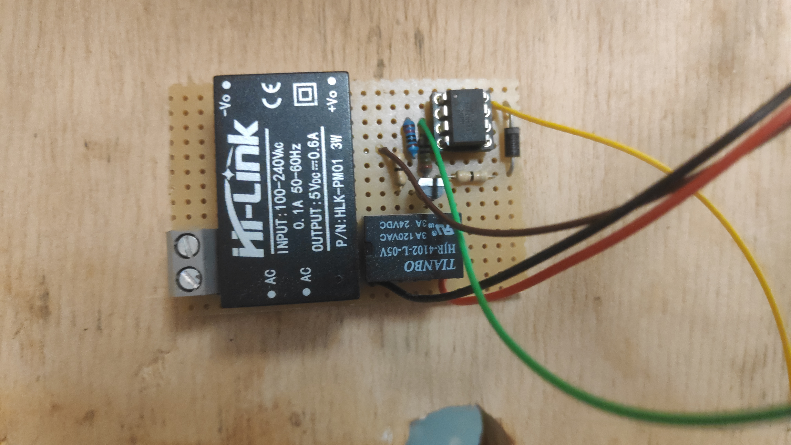
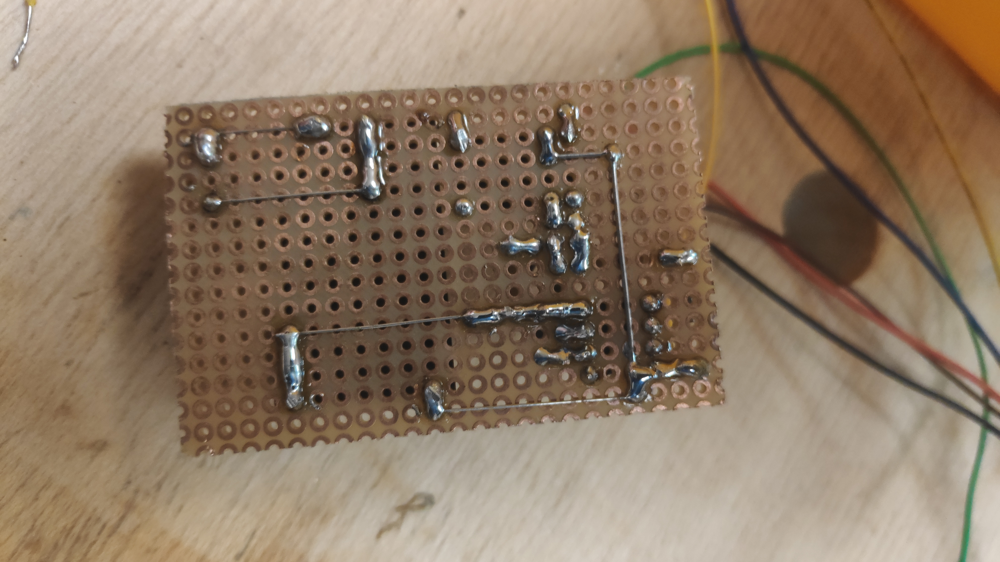
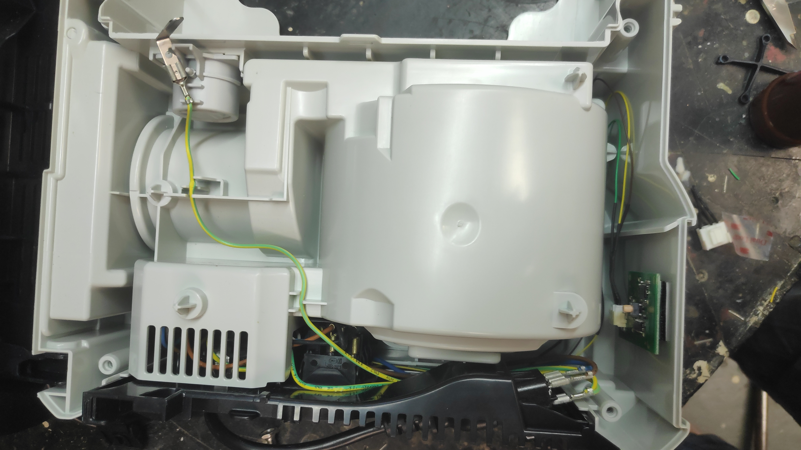
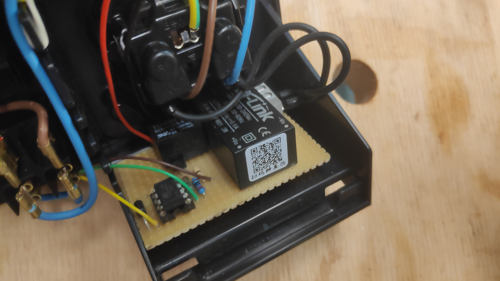
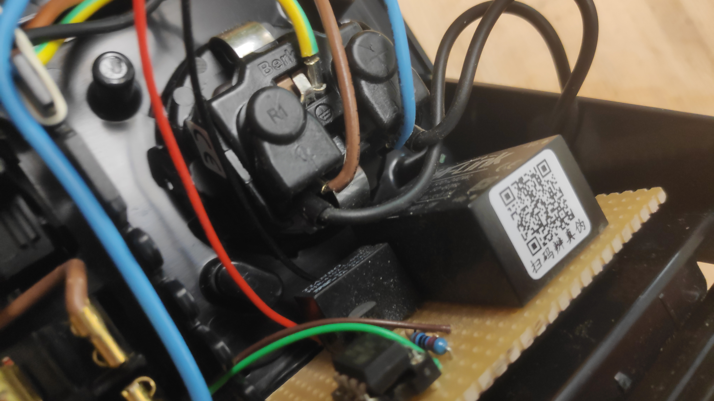

# Festool CTL SYS vacuum with bluetooth remote

YouTube video: https://youtu.be/E9ytORyrOFA

I really like my Festool CTL SYS but was missing the Bluetooth features of the bigger vacuums so I decided to retrofit the Bluetooth module CT-F I/M.

## Description
The Bluetooth module has 3 wires: 5V, GND, and a signal wire which will be GND most of the time and 5V for a short time when the button is pressed.

I made a custom PCB with an ATtiny85 microcontroller to add denouncing and translate the momentary signal into a persistent on/off signal for the vacuum.

The vacuum has ZH 5 pin connector. If you connect pin 1 to pin 2, the vacuum will start. I added a 5V power supply since I couldn't find a 5V power source on the Festool PCB which could handle 100mA of current required by the Bluetooth module + my custom module. I use the 230VAC from the socket since the current is not enough to trigger the vacuum in auto mode.

You can achieve the same functionality without using a microcontroller but since I am a software developer and have more knowledge about microcontroller then analog circuits I choose this approach.

## Costs:
- 75€/85$ for Festool Bluetooth module + remote CT-F I/M-Set (202097)
- 1€/1$ for ATtiny85 microcontroler
- 5€/5$ for 5V power supply
- 3€/3$ for ZH5 cable, relay, transistor, diode and resistors
------------
84€/94$ total

## Components:
- Festool CT-F I/M
- 5V relay e.g. HJR-4102-L 5V
- 1N4007 diode
- 10kOhm pull down resistor
- NPM transistor to control relay e.g. BC547B
- Gate resistor for transistor e.g 1kOhm 
- 5V power supply e.g HLK-PM01 5
- 5pin ZH5 cable

## Programming

The code is part of this GitHub repository. You can follow this guide to find out more about how to program the ATtiny85: https://create.arduino.cc/projecthub/arjun/programming-attiny85-with-arduino-uno-afb829

## Images

